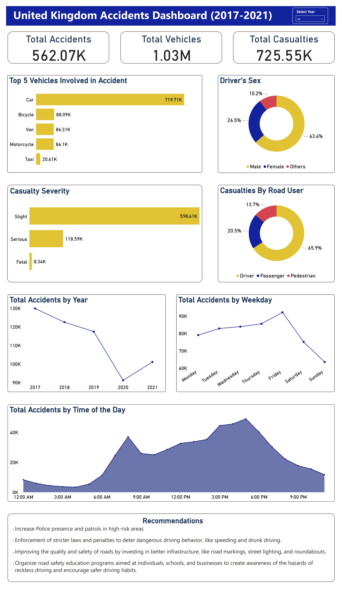

# United Kingdom Accident Analysis 2017-2021

This project aims to analyze accident data in the United Kingdom from 2017 to 2021, preprocess the dataset, and generate key insights. The analysis provides valuable information on vehicle types, casualty severity, time trends, and more, helping to identify patterns and inform road safety initiatives.

## Technologies Used

- Power BI

## Data Source

The accident data was obtained from [data.gov.uk](https://www.data.gov.uk/dataset/cb7ae6f0-4be6-4935-9277-47e5ce24a11f/road-safety-data).

## Data Analysis Process

1. Cleaned the dataset using Power Query, including removing unnecessary columns, handling missing values, and adjusting data types.
2. Visualized the top 5 vehicles involved in accidents using a bar chart.
3. Analyzed the distribution of drivers' sexes.
4. Examined casualty severity.
5. Explored casualties by road user.
6. Conducted time series analysis, including total accidents by year, total accidents by weekday, and total accidents by time of the day.

## Key Findings

- Cars were the most commonly involved vehicle type in accidents.
- The majority of accidents resulted in slight injuries, with a smaller percentage resulting in serious or fatal injuries.
- The majority of accidents occurred on weekdays, with Friday having the highest number of accidents.
- The most common time of the day for accidents was between 3pm to 6pm.

## Dashboard

Link to dashboard [here](https://app.powerbi.com/view?r=eyJrIjoiOGYyYWUyYTMtODAxNC00MGQ4LTlhYWUtMjQ1Nzc4NWRlNDI1IiwidCI6IjdlMWQwY2JlLTA0YjgtNDBmYS04MGVjLWU4ZTYyYmYzNzNiZCJ9).

## Recommendations

Based on the analysis, the following recommendations can be made:

1. Increase Police presence and patrols in high-risk areas and during weekdays evening.
2. Enforcement of stricter laws and penalties to deter dangerous driving behavior, like speeding and drunk driving.
3. Improving the quality and safety of roads by investing in better infrastructure, like road markings, street lighting, and roundabouts.
4. Organise road safety education programs aimed at individuals, schools, and businesses to createawarness of the hazards of reckless driving and encourage safer driving habits.

## License

This project is licensed under [MIT License](LICENSE).
